### Google Maps API key (from Chapter 14)

Along with the ability to select a start and end date using the date-time picker, users can also select a location for the event. To do this, we'll be using Google Maps and their autocomplete feature.

First, you'll need to go to the [Google Maps JavaScript API](https://developers.google.com/maps/documentation/javascript/get-api-key)[^google_maps_javascript] page. Create a new account or sign in to an existing account.

Then you should see a "GET STARTED" button. Click that button and continue with the steps Google presents you.

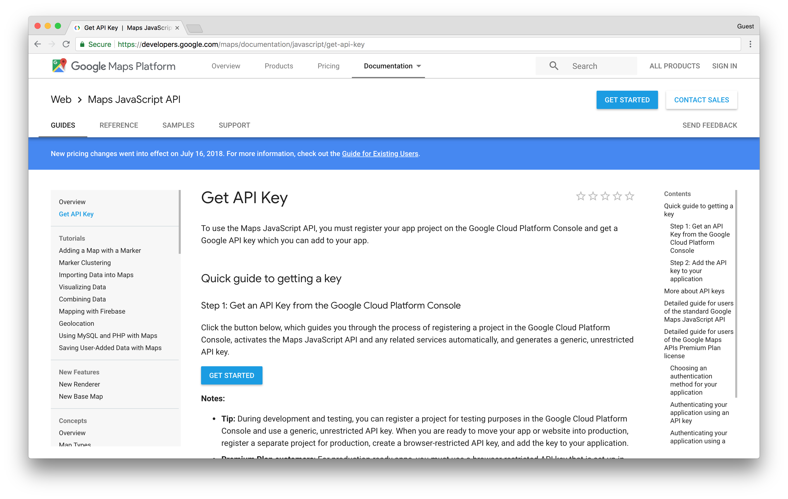

First, you'll be asked to select from a list of products. Select "Places".

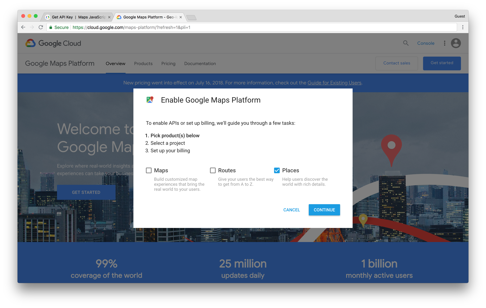

Then you'll be asked to enter a project name like "Let's Get Lunch".

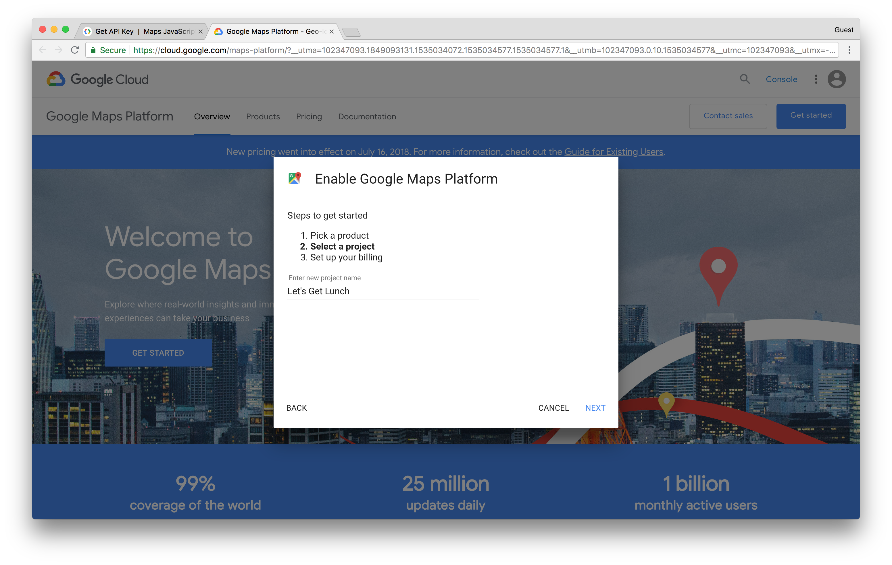

From here you'll be asked to set up billing for the account by clicking "CREATE BILLING ACCOUNT". Don't worry, you won't be charged unless you manually choose to upgrade your plan.

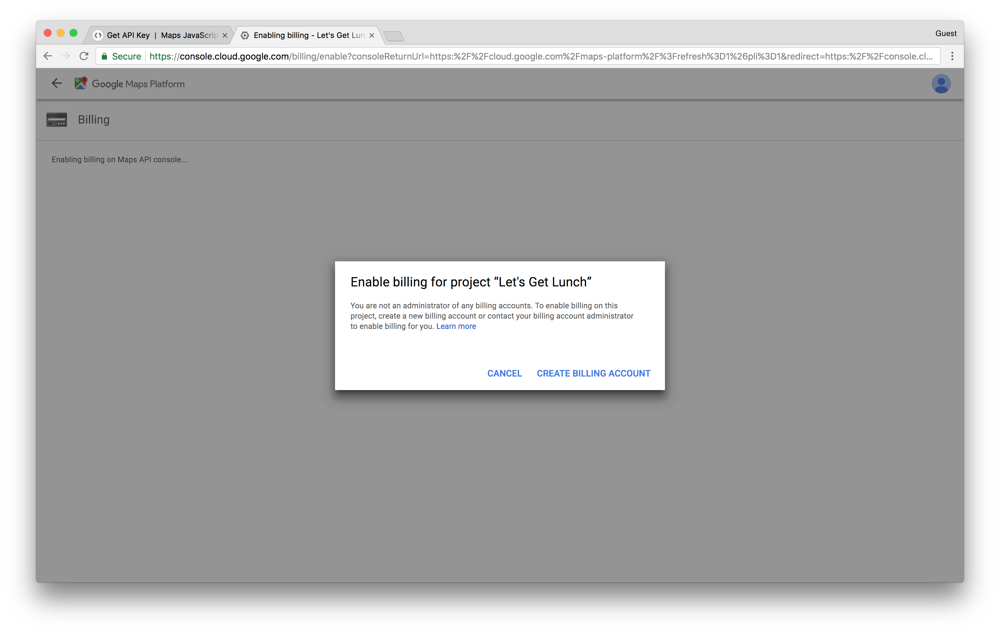

Select your country and agree to their terms of service.

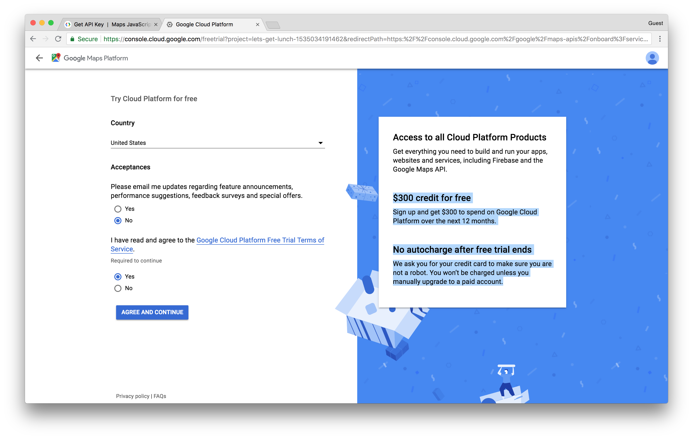

Then complete your personal and billing information.

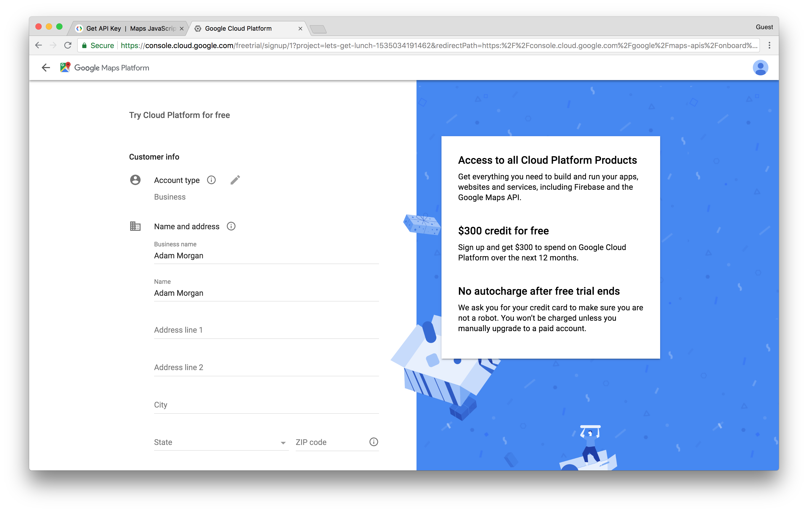

Once completed you'll be notified about your free trial with a note about how you **won't be billed until you give permission**. No need to worry about forking over cash here.

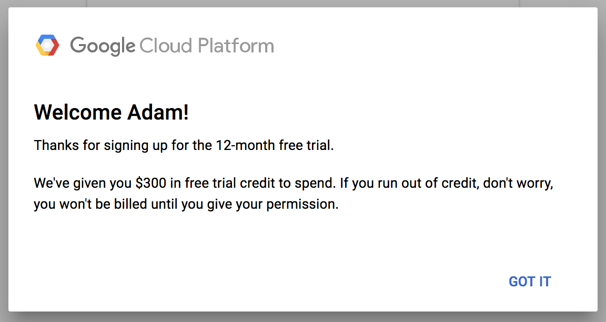

Once again you'll be asked to create a new project—slightly confusing UX here.

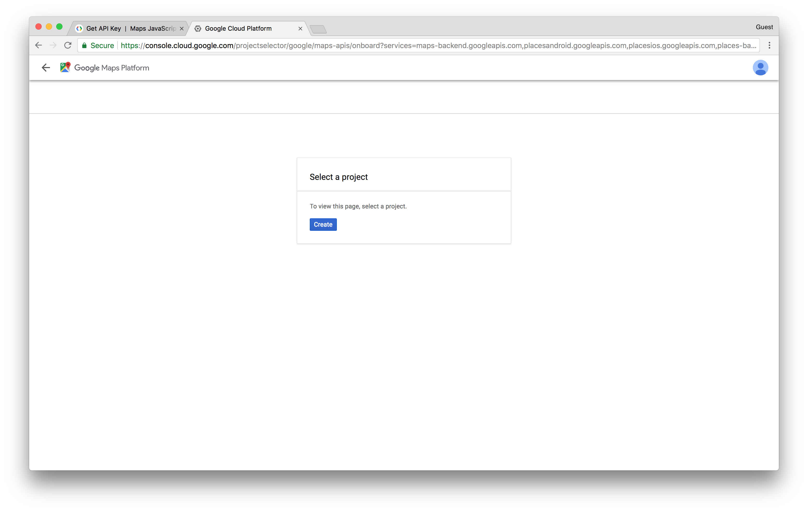

Add a project name like "Let's Get Lunch".

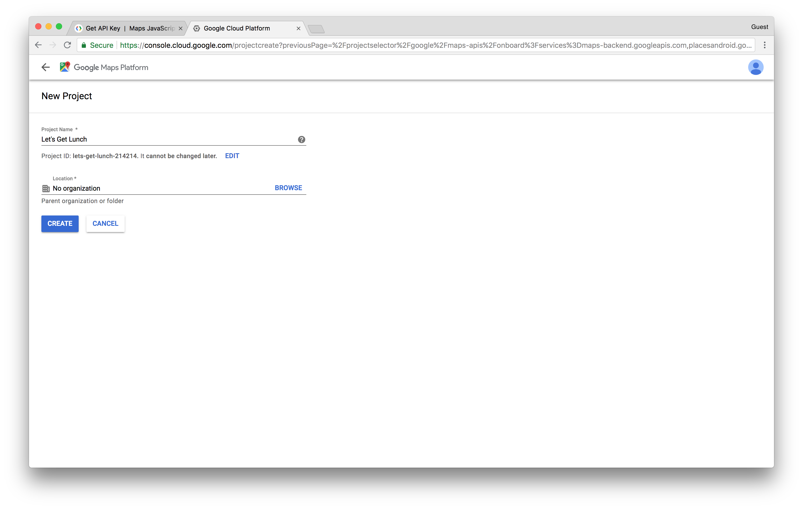

Then click "Next" when notified that you're about to enable the APIs.

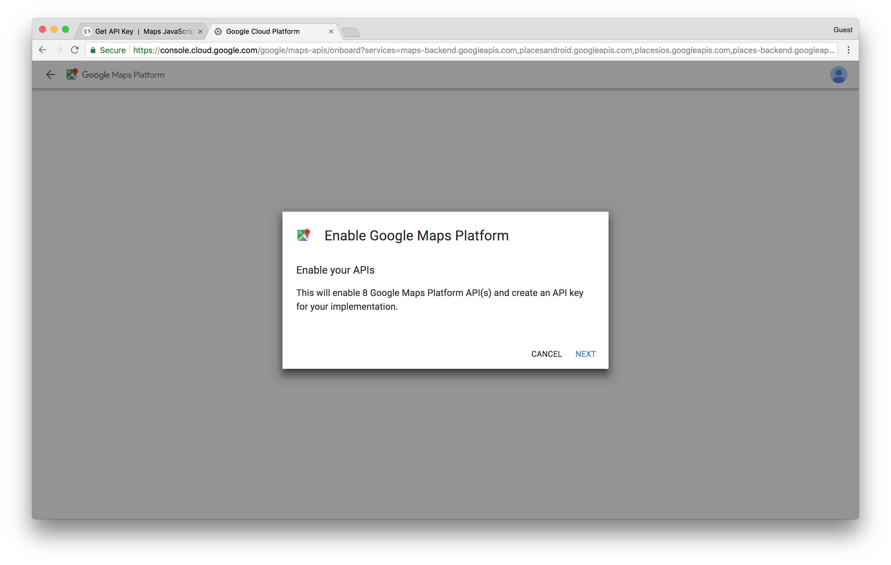

Finally, you should be presented with your API key. Keep this handy since you'll need it for the following steps.

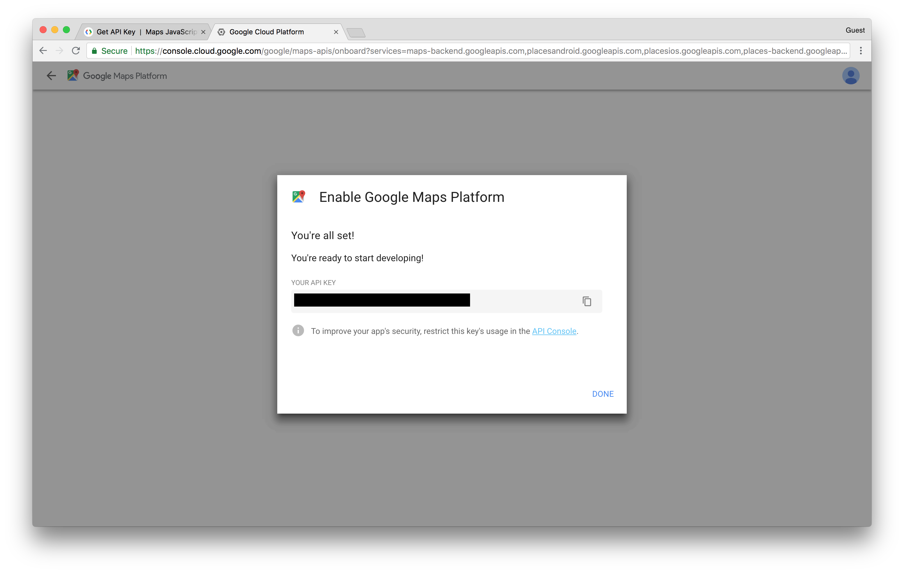