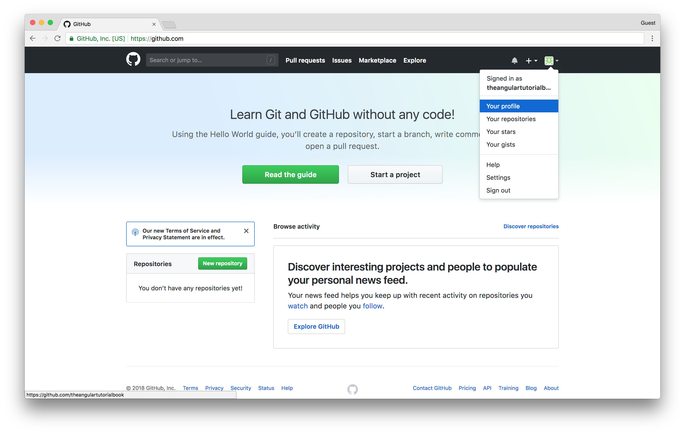
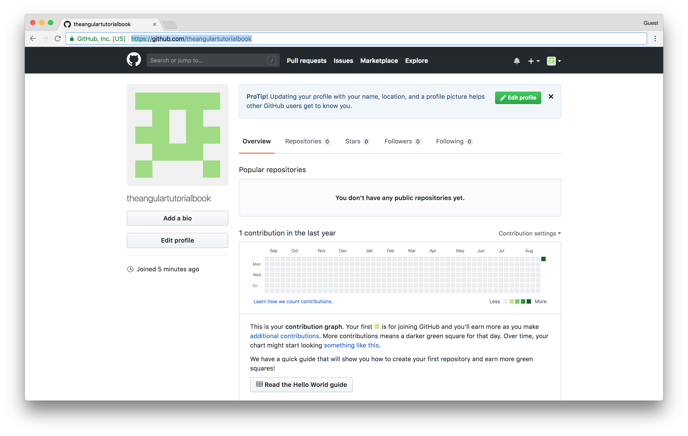
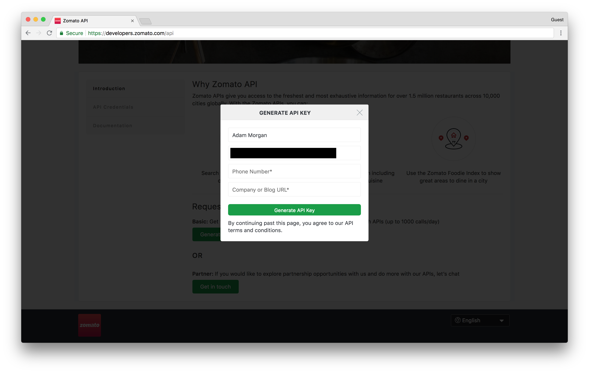
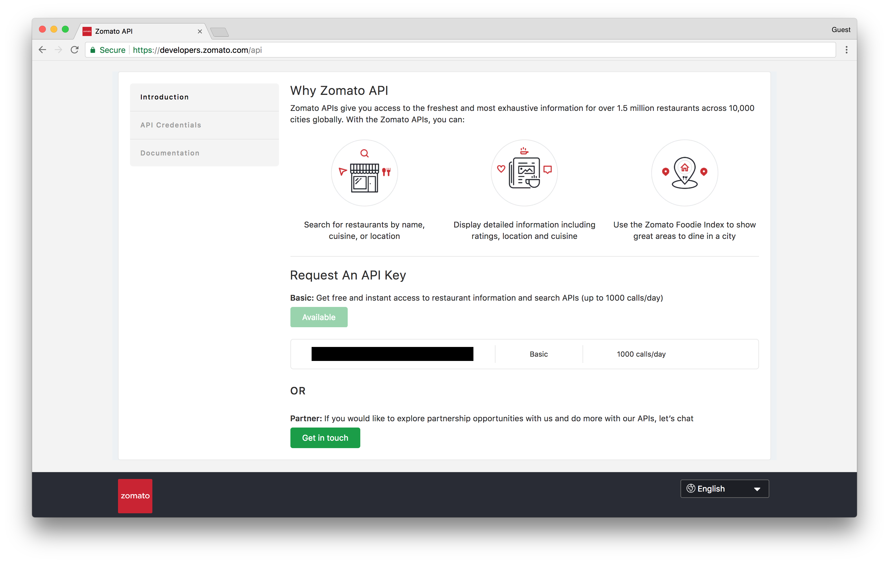

## Create GitHub account (from Chapter 4)

While we're working through this book, we'll be periodically pushing our code to GitHub. GitHub is a development platform that's primarily used for hosting code. GitHub and other similar services such as GitLab and Bitbucket are tools you're likely to encounter in your professional career so it doesn't hurt to familiarize yourself with them now.

Head over to [GitHub](`https://github.com/`)[^github] and create an account.

Once your account has been created you'll now have a GitHub profile which you can access in the top right corner by clicking on the avatar image and selecting "Your profile".

Your profile URL will be needed in our next step as we setup your Zomato account to get an API key.

Feel free to leave your GitHub window open since we'll need it at the end of this chapter when we add this API to your newly created account.

## Creating a Zomato account

As I mentioned earlier, our application is going to have the ability to provide restaurant recommendations for events. The API will be making this request using a service known as Zomato.

In order for the API to make that request, it's going to need an API key which you'll provide in a configuration file we're going to set up next. But first, we need a Zomato API key.

To do this, visit [Zomato](https://www.zomato.com)[^zomato] and create an account. Once you've created your account, you can then visit the [developer's section](https://developers.zomato.com/api)[^zomato_developer]. Near the bottom of the screen you should see a section titled "Request An API Key" with a button that says "Generate API key". Click that and you should see a window asking for additional information. Complete the form, adding your GitHub profile as the "Company or Blog URL", and you'll be given an API key. Go ahead and leave this window open since we'll need that key shortly.

